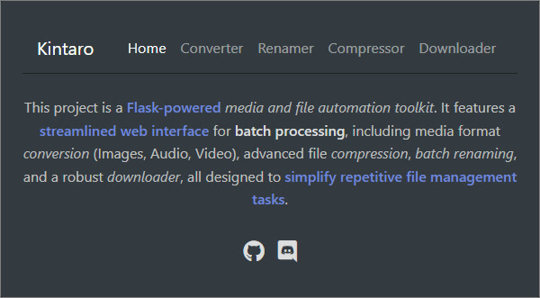
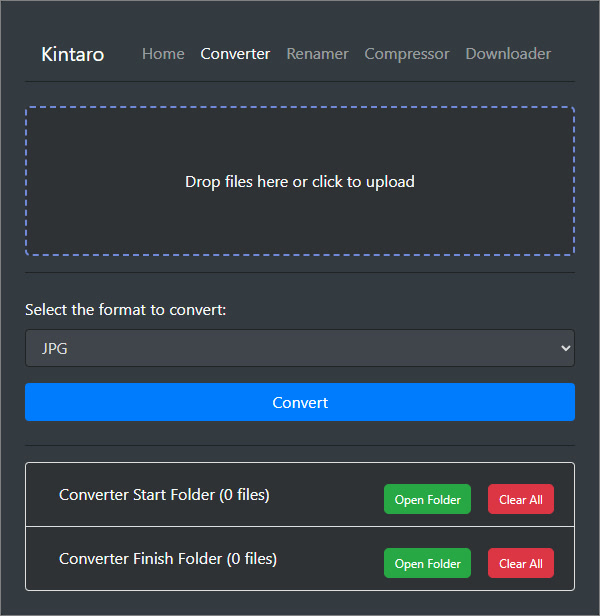
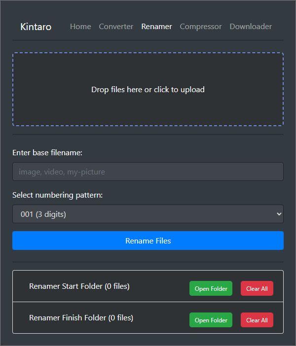
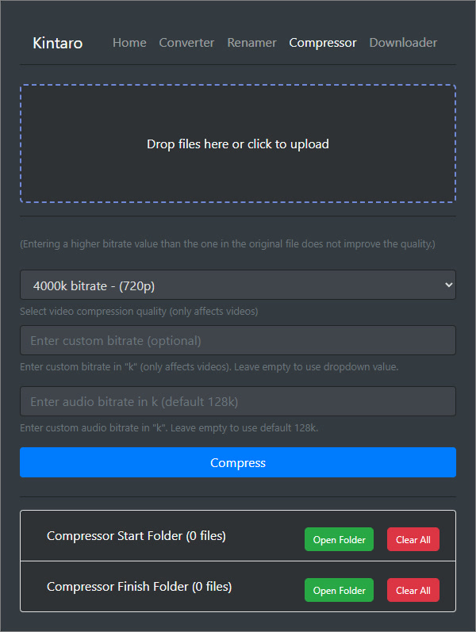
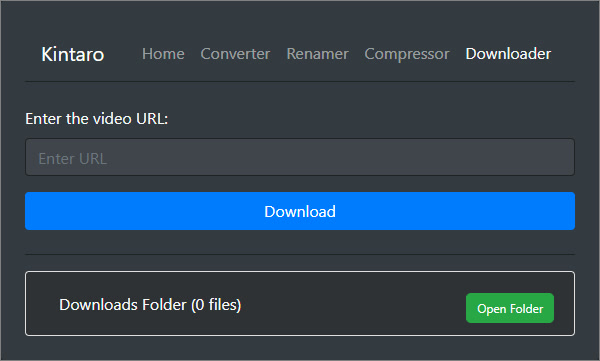

<div align="center">
  
  <br />
  <br />

[](https://www.python.org/)
[](https://flask.palletsprojects.com/)
[](https://getbootstrap.com/)
[](https://jquery.com/)
[](https://pillow.readthedocs.io/)
[](https://ffmpeg.org/)
[](https://github.com/yt-dlp/yt-dlp)

  <p align="center">
    <a href="#features">Features</a> •
    <a href="#technologies">Technologies</a> •
    <a href="#installation">Installation</a> 
  </p>
</div>

---

## 📋 About

A local web-based file utility toolkit built with Flask. It provides a simple browser interface for common file operations like format conversion, compression, batch renaming, and video downloading.



## <a id="features"></a> ✨ Features

### 🔄 File Converter

Convert files between different formats through a drag-and-drop interface.

- **Images:** JPG, JPEG, PNG, WEBP
- **Videos:** MP4, AVI, MOV, WEBM
- **Audio:** MP3, WAV, AAC, FLAC, OGG

### 📦 File Compressor

Reduce file sizes for images, videos, and audio files.

- Preset and custom bitrate options for video compression
- Adjustable audio bitrate
- Image optimization with quality control (JPEG, PNG, WEBP)

### 📝 Batch Renamer

Rename multiple files at once with a consistent naming pattern.

- Custom base filename
- Configurable zero-padded numbering (3 to 6 digits)
- Preserves original file extensions

### ⬇️ Video Downloader

Download videos from various platforms using [yt-dlp](https://github.com/yt-dlp/yt-dlp).

- Supports YouTube, TikTok, and other platforms that yt-dlp supports
- Downloads are saved with a timestamped filename



## <a id="technologies"></a> 🛠️ Technologies

- **Backend:** Python, Flask
- **Frontend:** HTML, CSS, Bootstrap 4, jQuery
- **Media Processing:** Pillow (images), MoviePy / FFmpeg (video & audio)
- **Downloading:** yt-dlp



## <a id="installation"></a> 🚀 Installation

1. **Clone the repository:**

   ```bash
   git clone https://github.com/xkintaro/py-tools.git
   cd py-tools
   ```

2. **Install dependencies:**

   ```bash
   pip install -r requirements.txt
   ```

   Or use the provided batch file on Windows:

   ```
   install_requirements.bat
   ```

3. **Run the application:**

   ```bash
   python app.py
   ```

   Or use the provided batch file on Windows:

   ```
   run.bat
   ```

4. The app will automatically open `http://127.0.0.1:5000` in your default browser.



## ⚙️ How It Works

The application uses a folder-based workflow:

1. **Upload or place files** into the corresponding `Start` folder (via drag-and-drop in the browser or manually through the file system).
2. **Choose your settings** and click the action button (Convert, Compress, Rename).
3. **Processed files** appear in the corresponding `Finish` folder. Source files are removed from the Start folder after successful processing.

Each tool has its own pair of working directories:

| Tool       | Input Folder       | Output Folder       |
| ---------- | ------------------ | ------------------- |
| Converter  | `converterStart/`  | `converterFinish/`  |
| Compressor | `compressorStart/` | `compressorFinish/` |
| Renamer    | `renamerStart/`    | `renamerFinish/`    |
| Downloader | —                  | `downloads/`        |

You can also open these folders directly from the web interface or clear them with a single click.



## 📂 Project Structure

```
py-tools/
├── app.py                     # Main Flask application
├── requirements.txt           # Python dependencies
├── run.bat                    # Windows run script
├── install_requirements.bat   # Windows dependency installer
├── modules/
│   ├── config.py              # Directory path configuration
│   ├── utils.py               # Shared utility functions
│   ├── kintaroConverter.py    # Format conversion logic
│   ├── kintaroCompressor.py   # File compression logic
│   ├── kintaroDownloader.py   # Video download logic
│   ├── kintaroRenamer.py      # Batch rename logic
│   ├── kintaroClearFolder.py  # Folder clearing endpoint
│   ├── kintaroOpenFolder.py   # Open folder in file explorer
│   └── kintaroUploadFiles.py  # File upload handling
├── templates/
│   ├── layout.html            # Base template with navbar
│   ├── index.html             # Home page
│   ├── kintaroConverter.html  # Converter page
│   ├── kintaroCompressor.html # Compressor page
│   ├── kintaroDownloader.html # Downloader page
│   └── kintaroRenamer.html    # Renamer page
└── static/
    ├── styles.css             # Application styles
    ├── fileUploader.js        # Drag-and-drop upload logic
    ├── folderOperations.js    # Open/clear folder actions
    ├── formHandlers.js        # Form submission handlers
    ├── fileListUpdater.js     # Dynamic file list refresh
    └── uiHelpers.js           # UI utility functions
```

## ✅ Supported Formats

### Conversion

| Input Type | Supported Formats        | Can Convert To                      |
| ---------- | ------------------------ | ----------------------------------- |
| Image      | JPG, JPEG, PNG, WEBP     | JPG, JPEG, PNG, WEBP                |
| Video      | MP4, AVI, MOV, WEBM      | MP4, AVI, MOV, WEBM + Audio formats |
| Audio      | MP3, WAV, AAC, FLAC, OGG | MP3, WAV, AAC, FLAC, OGG            |

### Compression

| Type  | Method                                           |
| ----- | ------------------------------------------------ |
| Image | Quality reduction & optimization (JPEG/PNG/WEBP) |
| Video | Bitrate adjustment (preset or custom)            |
| Audio | Bitrate adjustment (default 128k)                |

---

<p align="center">
  <sub>❤️ Developed by Kintaro.</sub>
</p>
